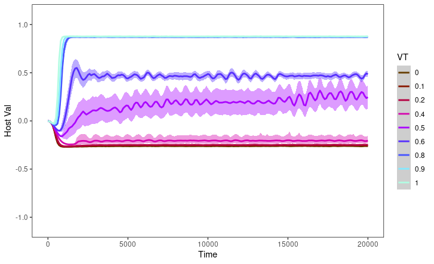

# Supplemental Graphs
The following are the graphs that we generated in our research. Config settings for several of the following experiments can be found in the ../Data folder.

## Graphs 08.23.21 Ectosymbiosis and immunity, 30 reps
This set of graphs explores the impacts of ectosymbiosis, and immunity, on evolution of endosymbiosis with the most recent settings and a robust (and novel) set of random seeds.

### Ectosymbiosis off
**Host Interaction Value**

**Free-living Symbiont Interaction Value**

**Hosted Symbiont Interaction Value**

**Free-living Symbiont Infection Chance**

**Hosted Symbiont Infection Chance**

**Free-living Symbiont Count**

**Hosted Symbiont Count**

### Ectosymbiosis on, immunity off
**Host Interaction Value**

**Free-living Symbiont Interaction Value**

**Hosted Symbiont Interaction Value**

**Free-living Symbiont Infection Chance**

**Hosted Symbiont Infection Chance**

**Free-living Symbiont Count**

**Hosted Symbiont Count**

### Ectosymbiosis on, immunity on
**Host Interaction Value**

**Free-living Symbiont Interaction Value**

**Hosted Symbiont Interaction Value**

**Free-living Symbiont Infection Chance**

**Hosted Symbiont Infection Chance**

**Free-living Symbiont Count**

**Hosted Symbiont Count**

## Graphs 08.18.21 Symbiont vertical transmission resource minimum sweep
With this experiment we hoped to improve conditions for hosted symbionts by giving their hosts more resources and checking at what svtr mutualism evolves. (graphs are wrapped by SVTR)

**Host Interaction Value**

**Free-living Symbiont Interaction Value**

**Hosted Symbiont Interaction Value**

**Free-living Symbiont Infection Chance**

**Hosted Symbiont Infection Chance**

**Free-living Symbiont Count**

**Hosted Symbiont Count**

**Free Symbiont Interaction Value Histogram**

**Free Symbiont Infection Chance Histogram**

**Hosted Symbiont Interaction Value Histogram**

**Hosted Symbiont Infection Chance Histogram**

## Graphs 08.16.21 De novo evolution of symbiosis
Here we examine the de novo evolution of symbiosis at these settings, which are used for the rest of the 08.16.21 experiments (with some modification).

**Host Interaction Value**

**Free-living Symbiont Interaction Value**

**Hosted Symbiont Interaction Value**

**Free-living Symbiont Infection Chance**

**Hosted Symbiont Infection Chance**

**Free-living Symbiont Count**

**Hosted Symbiont Count**

## Graphs 08.16.21 Mixed starting interaction values and infection chance
With this experiment, we observed whether new settings yielded significant symbioses when hosts and symbionts began with randomized interaction values (rather than the traditional 0), and symbionts with randomized infection chance (again opposed to the standard 0).

**Host Interaction Value**

**Free-living Symbiont Interaction Value**

**Hosted Symbiont Interaction Value**

**Free-living Symbiont Infection Chance**

**Hosted Symbiont Infection Chance**

**Free-living Symbiont Count**

**Hosted Symbiont Count**

## Graphs 08.16.21 Free symbiont resource distribute sweep with mixed starting interaction values and infection chance
This experiment modified the number of resources free symbionts received the world, intending to make free living either more difficult or more attractive. It can be contrasted to “08.16.21 FSRD sweep with fixed starting IV and IC.” Graphs are wrapped by FSRD (free sym resource distribute).

**Host Interaction Value**

**Free-living Symbiont Interaction Value**

**Hosted Symbiont Interaction Value**

**Free-living Symbiont Infection Chance**

**Hosted Symbiont Infection Chance**

**Free-living Symbiont Count**

**Hosted Symbiont Count**

**Symbiont Interaction Value Histogram**

**Symbiont Infection Chance Histogram**

## Graphs 08.16.21 Free symbiont resource distribute sweep, de novo evolution of (endo)symbiosis
This experiment modified the number of resources free symbionts received the world, intending to make free living either more difficult or more attractive. Given that interaction values and infection chance is initialized to zero for all organisms, this investigates de novo evolution of symbiotic behaviour. It can be contrasted to “08.16.21 FSRD sweep with mixed starting IV and IC.” Graphs are wrapped by FSRD (free sym resource distribute).

**Host Interaction Value**

**Free-living Symbiont Interaction Value**

**Hosted Symbiont Interaction Value**

**Free-living Symbiont Infection Chance**

**Hosted Symbiont Infection Chance**

**Free-living Symbiont Count**

**Hosted Symbiont Count**

**Symbiont Interaction Value Histogram**

**Symbiont Infection Chance Histogram**

## Graphs 08.16.21 Ectosymbiosis on and ectosymbiotic immunity off
Here we examine how the new ectosymbiotic functionality impacts evolution of symbiotic behaviours. Can be contrasted to “08.16.21 Ectosymbiosis on and ectosymbiotic immunity on.”

**Host Interaction Value**

**Free-living Symbiont Interaction Value**

**Hosted Symbiont Interaction Value**

**Free-living Symbiont Infection Chance**

**Hosted Symbiont Infection Chance**

**Free-living Symbiont Count**

**Hosted Symbiont Count**

**Symbiont Interaction Value Histogram**

**Symbiont Infection Chance Histogram**

## Graphs 08.16.21 Ectosymbiosis on and ectosymbiotic immunity on
Here we examine how the new ectosymbiotic functionality impacts evolution of symbiotic behaviours when possession of a hosted symbiont renders a host immune to ectosymbiosis. Can be contrasted to “08.16.21 Ectosymbiosis on and ectosymbiotic immunity off.”

**Host Interaction Value**

**Free-living Symbiont Interaction Value**

**Hosted Symbiont Interaction Value**

**Free-living Symbiont Infection Chance**

**Hosted Symbiont Infection Chance**

**Free-living Symbiont Count**

**Hosted Symbiont Count**

**Symbiont Interaction Value Histogram**

**Symbiont Infection Chance Histogram**

## Graphs 1 svtr plot
Settings: Symbiont Vertical Transmission Resource Cost Sweep, Symbiont Horizontal Transmission Resource Cost 400, Mutation Rate 0.05, Infection rate 0.5

**Free-living Symbiont Infection Chance**

**Free-living Symbiont Count**

**Free-living Symbiont Interaction Value**

**Hosted Symbiont Infection Chance**

**Hosted Symbiont Count**

**Hosted Symbiont Interaction Value**

**Host Interaction Value**

## Graphs 2 shtr plots
Settings: Symbiont Horizontal Transmission Resource Cost Sweep, Symbiont Vertical Transmission Resource Cost 0, Mutation Rate 0.05, Infection rate 0.0

**Free-living Symbiont Infection Chance**

**Free-living Symbiont Count**

**Free-living Symbiont Interaction Value**

**Hosted Symbiont Infection Chance**

**Hosted Symbiont Count**

**Hosted Symbiont Interaction Value**

**Host Interaction Value**

## Graphs 3 shtr400

Settings: Symbiont Horizontal Transmission Resource Cost 400, Mutation Size 0.02, Infection rate 0.5

**Free-living Symbiont Infection Chance**

**Free-living Symbiont Count**

**Free-living Symbiont Interaction Value**

**Hosted Symbiont Infection Chance**

**Hosted Symbiont Count**

**Hosted Symbiont Interaction Value**

**Host Interaction Value**

## Graphs 4 gridon plots

Settings: Symbiont Horizontal Transmission Resource Cost 400, Mutation Size 0.02, Mutation Rate 1, Grid on

**Free-living Symbiont Infection Chance**

**Free-living Symbiont Count**

**Free-living Symbiont Interaction Value**

**Hosted Symbiont Infection Chance**

**Hosted Symbiont Count**

**Hosted Symbiont Interaction Value**

**Host Interaction Value**

## Graph 5 ifr sweep

Settings: Symbiont Infection Rate Sweep, Symbiont Horizontal Transmission Resource Cost 400, Mutation Size 0.02, Infection rate 0.5

**Free-living Symbiont Infection Chance**

**Free-living Symbiont Count**

**Free-living Symbiont Interaction Value**

**Hosted Symbiont Infection Chance**

**Hosted Symbiont Count**

**Hosted Symbiont Interaction Value**

**Host Interaction Value**

## Graph 6 mixed ivic
Settings: Mixed Interaction Value, Mixed Infection Chance, Mutation Rate 0.05, Failure Rate 0.0

**Free-living Symbiont Infection Chance**

**Free-living Symbiont Count**

**Free-living Symbiont Interaction Value**

**Hosted Symbiont Infection Chance**

**Hosted Symbiont Count**

**Hosted Symbiont Interaction Value**

**Host Interaction Value**

## Graphs 7 mixed ivic sht 400

Settings: Mixed Infection Chance, Mixed Interaction Value,  Symbiont Horizontal Transmission Resource Cost 400, Mutation Size 0.02, Failure Rate 0.5

**Free-living Symbiont Infection Chance**

**Free-living Symbiont Count**

**Free-living Symbiont Interaction Value**

**Hosted Symbiont Infection Chance**

**Hosted Symbiont Count**

**Hosted Symbiont Interaction Value**

**Host Interaction Value**

## Graph 8 moveon plots
Settings: Movement on, Symbiont Horizontal Transmission Resource Cost 400, Mutation Size 0.02, Infection rate 0.5

**Free-living Symbiont Infection Chance**

**Free-living Symbiont Count**

**Free-living Symbiont Interaction Value**

**Hosted Symbiont Infection Chance**

**Hosted Symbiont Count**

**Hosted Symbiont Interaction Value**

**Host Interaction Value**

## Graph 9

Settings: Symbiont Vertical Transmission Resource Cost Sweep, Symbiont Horizontal Transmission Resource Cost 400, Mutation Rate 0.05, Infection rate 0.5

**Free-living Symbiont Infection Chance**

**Free-living Symbiont Count**

**Free-living Symbiont Interaction Value**

**Hosted Symbiont Infection Chance**

**Hosted Symbiont Count**

**Hosted Symbiont Interaction Value**

**Host Interaction Value**

